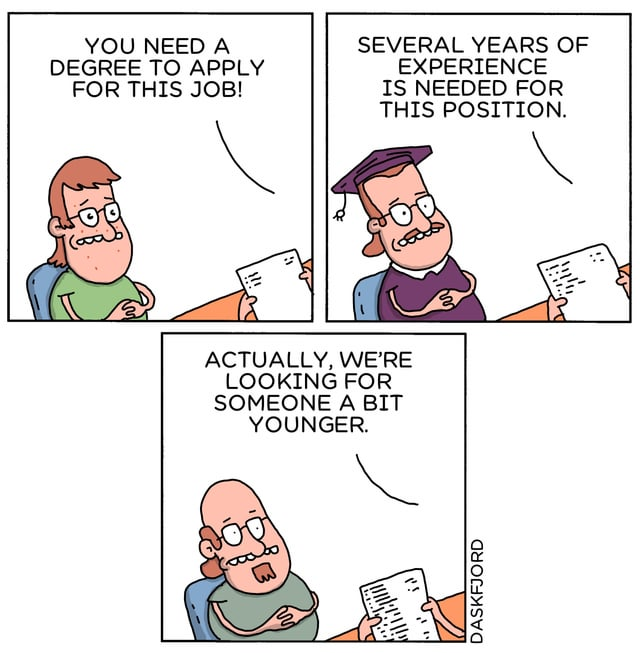

# American Economy and Work Culture Project
The American economy has been experiencing a downturn since 2023. There are anecdotal evidences, data, and public sentiment.  
Bad Economy (2023 - present)  
<b>"It's a recession when your neighbor loses his job; it's a depression when you lose yours. -  Harry S Truman"</b> 
<h3>Idiosyncrasy of the American Work Culture:</h3>

<h3>Across Generations:</h3>

<h3>Anecdotal Evidences (from Internet):</h3>
<h4>[ Economy and Workers ]</h4>

 Seriously, let's break this down...

We're constantly bombarded with economic "news" and narratives that just don't match the reality of what it feels like to be a working person trying to survive, let alone thrive:

1. Inflation & "Greedflation":
    * The Gaslight: "Inflation is complex," "It's supply chains,"
    * The Reality We Feel: Corporations are posting RECORD profits. They raise prices because they can, blame it on anything else, and then tell us we need to tighten our belts. Meanwhile, our wages are stagnant dust motes in the wind of their billions. "Shrinkflation" is just a polite term for them giving us less for more money.
2. Wages & "Labor Shortages":
    * The Gaslight: "Nobody wants to work anymore!" (Often said by people who've never worked a minimum wage job in their life).
    * The Reality We Feel: Nobody wants to work for poverty wages in soul-crushing, disrespectful conditions with no benefits or future. There isn't a labor shortage; there's a living wage and dignity shortage. Offer fair pay and decent conditions, and watch those vacancies fill.
3. Productivity & "Efficiency":
    * The Gaslight: "We need to maximize productivity and efficiency to stay competitive!"
    * The Reality We Feel: Our productivity has skyrocketed for decades, yet our share of that increased wealth has flatlined or declined. "Efficiency" often means skeleton crews, doing the work of three people, constant pressure, and burnout, all so executives and shareholders can extract even more value from our labor.
4. Housing & Cost of Living:
    * The Gaslight: "Just budget better," "Move somewhere cheaper" (as if that's easy or doesn't have its own costs), "Stop buying avocado toast."
    * The Reality We Feel: Rent is insane. Homeownership is a distant dream for many. Basic necessities cost more every month. We arebudgeting, we're cutting back, and it's still not enough because the system feels fundamentally rigged against us. Investment firms buying up single-family homes doesn't help either.
5. "Work Hard, Get Ahead":
    * The Gaslight: This narrative is still pushed, despite all evidence to the contrary for vast swathes of the population.
    * The Reality We Feel: We're working harder than ever, often multiple jobs, and still falling behind or just treading water. The goalposts haven't just moved; they're on a different planet for many.

<h4>[ As a European, the U.S. work culture looks like dystopia with better branding ]</h4>

 I seriously don’t know how you guys do it. Watching U.S. work culture from Europe feels like watching a never-ending episode of Black Mirror, but everyone’s been gaslit into thinking it’s "just how things are."

Let’s start with paid vacation. You guys get what, 0 federally mandated days off? Most Americans I’ve met are happy with 10 days a year like it’s a privilege. In most of Europe, we get at least 20-25 days of paid vacation BY LAW. And that doesn’t include public holidays. You guys get grilled for taking a week off, while our employers basically expect us to disappear for most of August.

And then there’s healthcare. Jesus. You tie one of the most basic human rights—access to healthcare—to employment. You lose your job, you lose your health insurance. Meanwhile over here, I can break a leg, go to the ER, get surgery, and not pay a single cent out of pocket. You get an ambulance ride and it’s like "congrats, that’s $3,000."

Don’t get me started on maternity and paternity leave. Most U.S. mothers are back to work within WEEKS. WEEKS! We give people months, sometimes up to a year, with partial or full pay, and dads too. It’s considered basic decency. But apparently in the U.S., bonding with your newborn is less important than boosting quarterly profits.

Then there’s the culture of overwork. Hustle. Grind. "If you’re not working 60 hours a week, you don’t want it bad enough." No thanks. In most of Europe, if your boss texts you after work hours, that’s harassment. In France it’s literally illegal to expect people to check emails after work. You guys brag about having to work weekends. We riot.

No job security, no protections, no dignity. At-will employment? You can be fired for any reason or none at all? That’s not freedom—that’s instability. People working 2–3 jobs just to survive. You have billionaires in bunkers and nurses living out of their cars.

You’ve normalized corporate feudalism and called it "the American Dream."
And somehow you’ve all been convinced that asking for basic labor rights makes you a lazy communist? Over here, even the centrists support unions and public healthcare. You can be right-wing and still agree people shouldn’t die because they can’t afford insulin.

I’m not saying Europe’s perfect. But holy hell, compared to the U.S., we’re living in a damn utopia. How are you not rioting in the streets daily?

Sending love and solidarity from across the Atlantic. You deserve better. Seriously.

<h4><b>[ Netflix Korean Show "Trigger" - Insights into societal instability ]</b></h4>

<b>"What would happen if everyone in Korea/[insert your country] had a gun?

In the end, what angers and humiliates people the most is other people.

Selfish, disrespectful people.

But strangely, when you have a gun, they act differently."
- Moon Baek</b>

